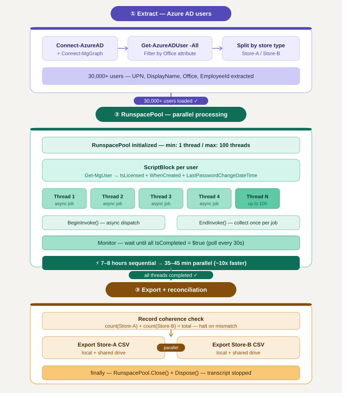

# azure-ad-bulk-operations

> PowerShell toolkit for bulk Azure AD operations at scale — parallel user extraction, license validation, and attribute reporting using RunspacePool for 30,000+ users.

---

## Origin & Disclaimer

These scripts are derived from production scripts used in real enterprise environments.
They have been anonymized, refactored, and generalized for public release.

**Provided as-is, without warranty. Always validate in a lab environment before production use.**

---

## Overview

Processing 30,000+ Azure AD users sequentially with `Get-MgUser` takes hours.
This toolkit uses PowerShell **RunspacePool** to parallelize the workload across up to 100 concurrent threads — reducing processing time from several hours to ~7 minutes.

**The business problem:**
- Large enterprise with 30,000+ frontline worker accounts across multiple store types
- Need to extract user attributes, license status, and password change timestamps
- Sequential processing was too slow for daily reporting workflows

**The automated solution:**
- Extract users from Azure AD filtered by Office attribute
- Dispatch each user as an async job to a RunspacePool (100 threads)
- Collect results via `EndInvoke()` once all threads complete
- Validate record coherence before exporting split CSV files to shared drive

---

## Architecture


---

## Key Technical Patterns

| Pattern | Implementation |
|---|---|
| Parallel processing | `RunspacePool` with configurable thread count |
| Async job dispatch | `BeginInvoke()` — non-blocking job submission |
| Result collection | `EndInvoke()` — called exactly once per job |
| Completion monitoring | `IsCompleted` polling loop with progress |
| Record coherence | Count validation before export — halt on mismatch |
| Resource cleanup | `finally` block — `Close()` + `Dispose()` guaranteed |
| Progress tracking | `Write-Progress` during job dispatch |

---

## Performance

| Method | Users | Time |
|---|---|---|
| Sequential `foreach` | 30,000 | ~7-8 hours |
| RunspacePool (100 threads) | 30,000 | ~35 minutes |
| Speedup | — | **~13x faster** |

---

## RunspacePool Pattern

```powershell
# Create pool
$Pool = [runspacefactory]::CreateRunspacePool(1, $MaxThreads)
$Pool.Open()

# Dispatch jobs — BeginInvoke() is non-blocking
$Jobs = foreach ($User in $UserList) {
    $Job = [System.Management.Automation.PowerShell]::Create()
    $Job.RunspacePool = $Pool
    $Job.AddScript($ScriptBlock).AddArgument($User) | Out-Null
    [PSCustomObject]@{ Pipe = $Job; Result = $Job.BeginInvoke() }
}

# Wait for completion
do { Start-Sleep -Seconds 30 } while ($Jobs.Result.IsCompleted -contains $false)

# Collect results — EndInvoke called exactly ONCE per job
$Results = foreach ($Job in $Jobs) { $Job.Pipe.EndInvoke($Job.Result) }

# Cleanup — always in finally block
$Pool.Close()
$Pool.Dispose()
```

---

## Repository Structure

| Path | Description |
|---|---|
| `src/Get-UserAttributesParallel.ps1` | RunspacePool parallel attribute retrieval |
| `templates/users-template.csv` | Input template |
| `examples/example-run.ps1` | Example invocations |
| `docs/images/` | Architecture diagrams |
| `LICENSE` | License file |
| `README.md` | This file |

---

## Requirements

| Requirement | Details |
|---|---|
| PowerShell | 5.1 or later |
| Module | `Microsoft.Graph` |
| Permissions | `User.Read.All`, `Directory.Read.All` |
| Shared drive | Network path for CSV output |

---

## What Makes This Production-Grade

- **RunspacePool** — true parallel processing, not just background jobs
- **BeginInvoke/EndInvoke** — correct async pattern, `EndInvoke` called exactly once
- **Coherence check** — validates count integrity before writing any output
- **Configurable thread count** — tune for your environment and API throttling limits
- **Guaranteed cleanup** — `finally` block ensures pool disposal even on error
- **Transcript** — full execution log for audit and debugging

---

## Author

**Brahim O.**
Derived from a production script processing 30,000+ frontline worker accounts in a large retail enterprise environment.

---

## License

This project is licensed under the terms of the [LICENSE](LICENSE) file.
